# Setup
---

### Create your own Firebase Project
Go to:
[Firebase](https://console.firebase.google.com/u/0/)
And login with your Google account.

https://console.firebase.google.com/u/0/

---
### Creating 

---
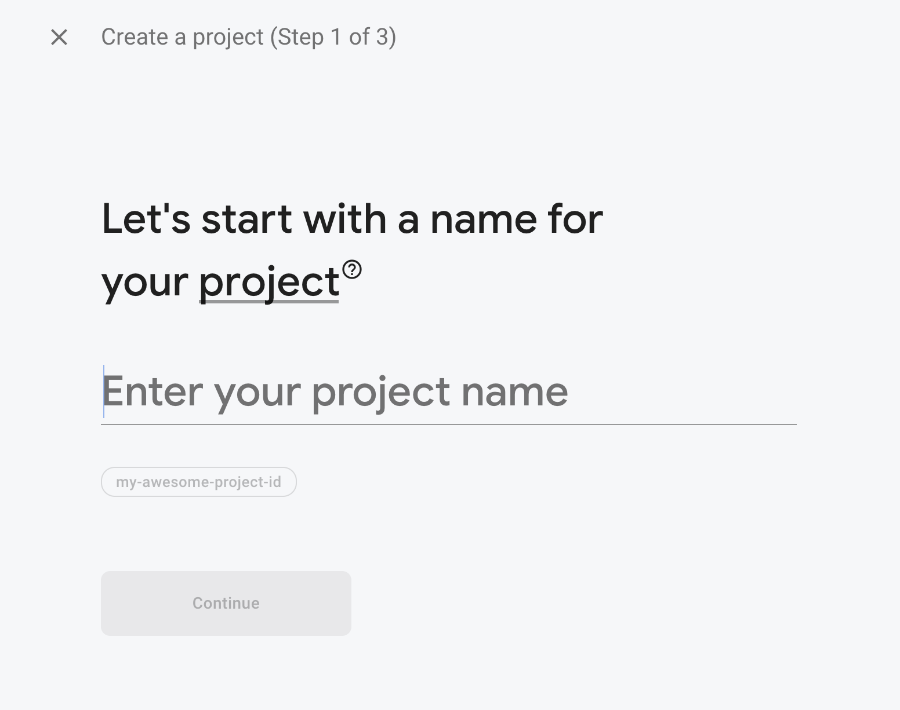

---
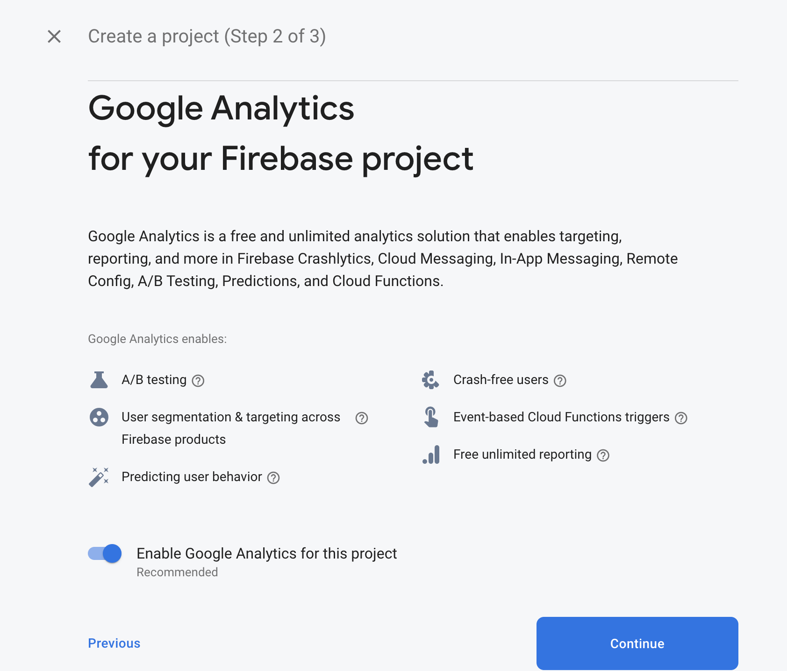

---
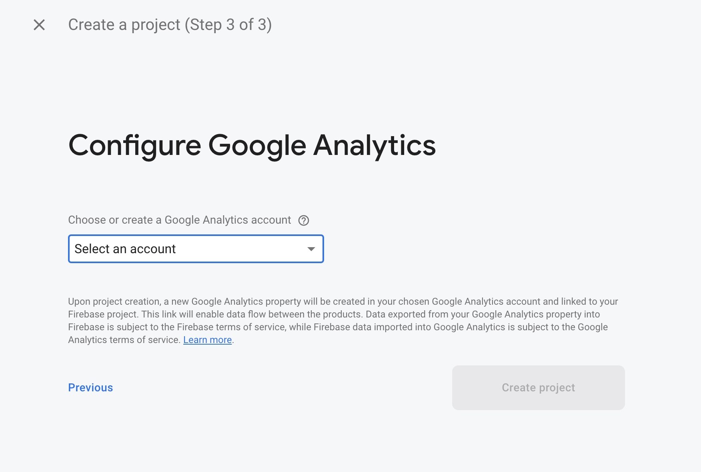

---
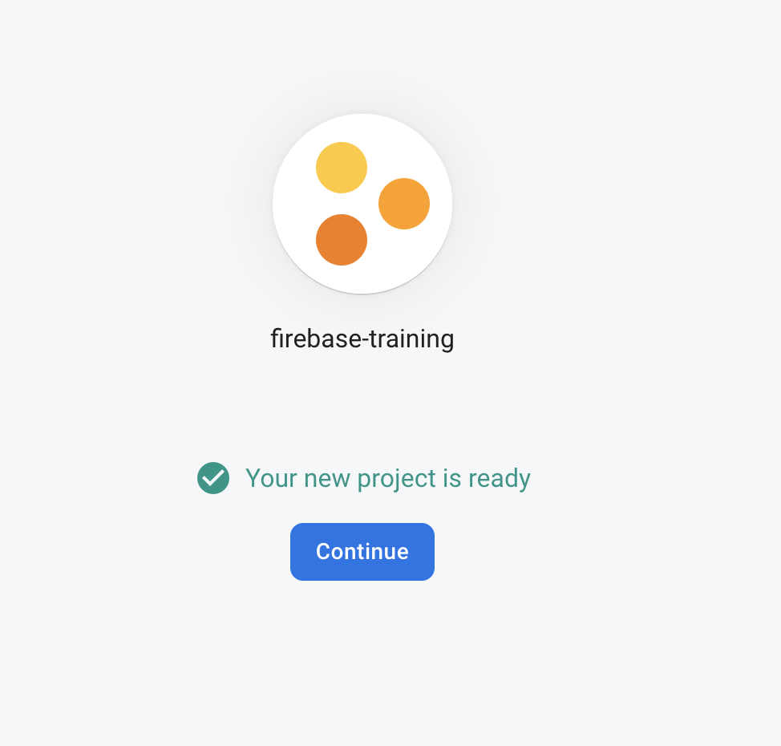

---
## Add Firebase to your project
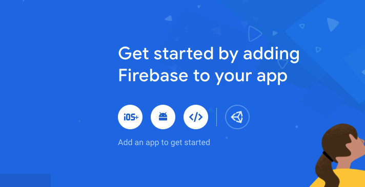

---
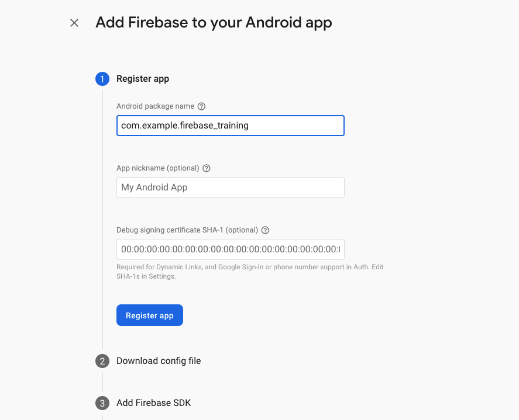

---
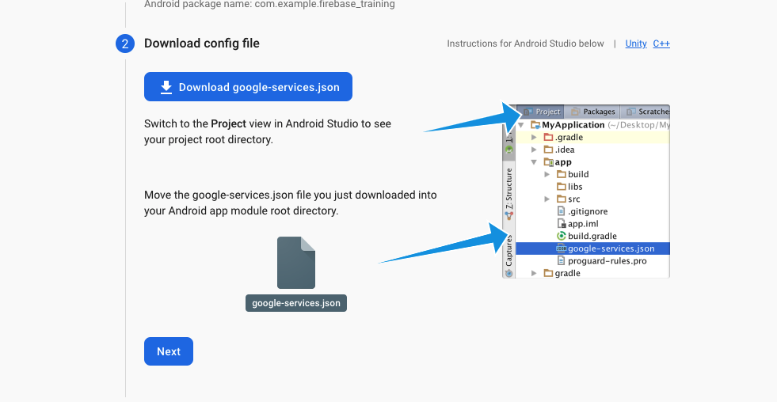

---
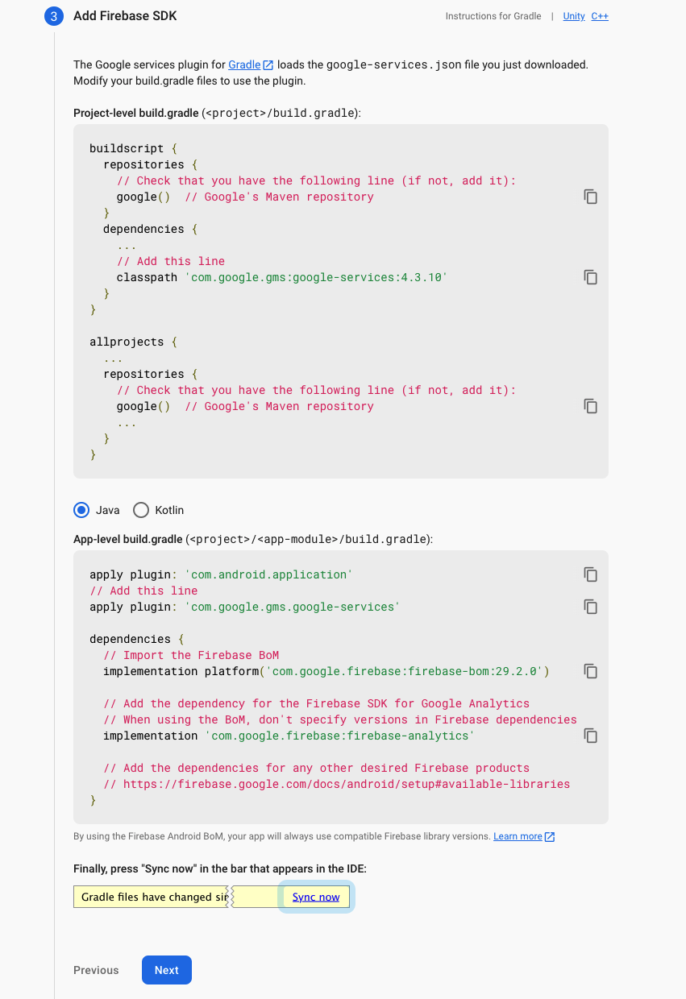

---
# Firebase Core
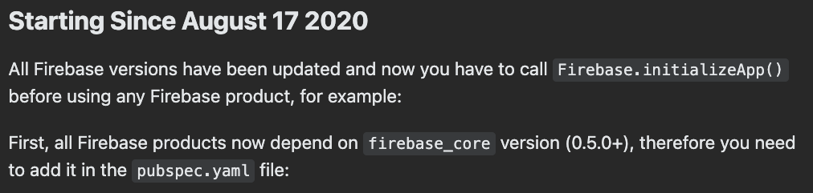

---
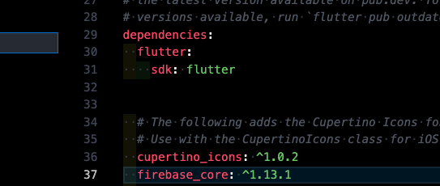

---

---
# Ready to go!
More platforms will be added soon.

---
### IOS
- Only for Mac users

---

---
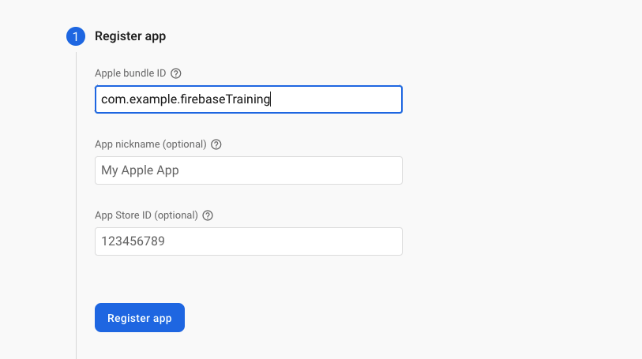

---
- Placing the file in this location is not enough!
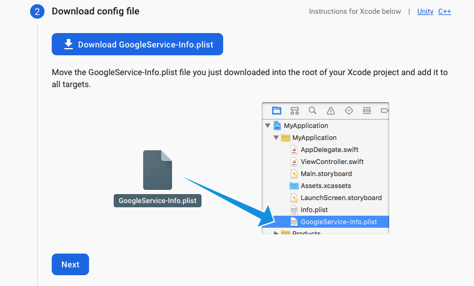

---
- After moving the file into the runner folder
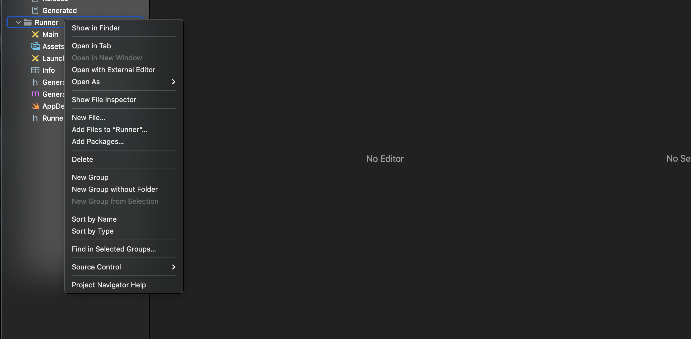

---
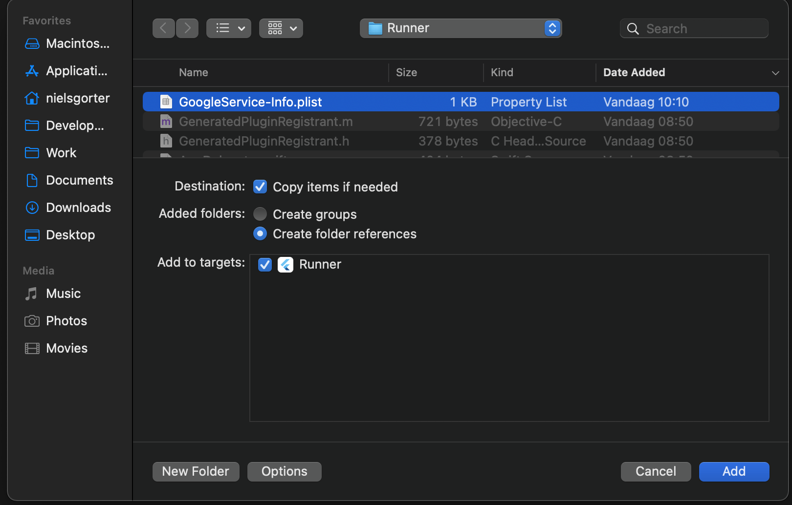

---
# Web

---

---
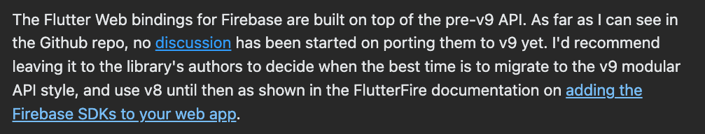
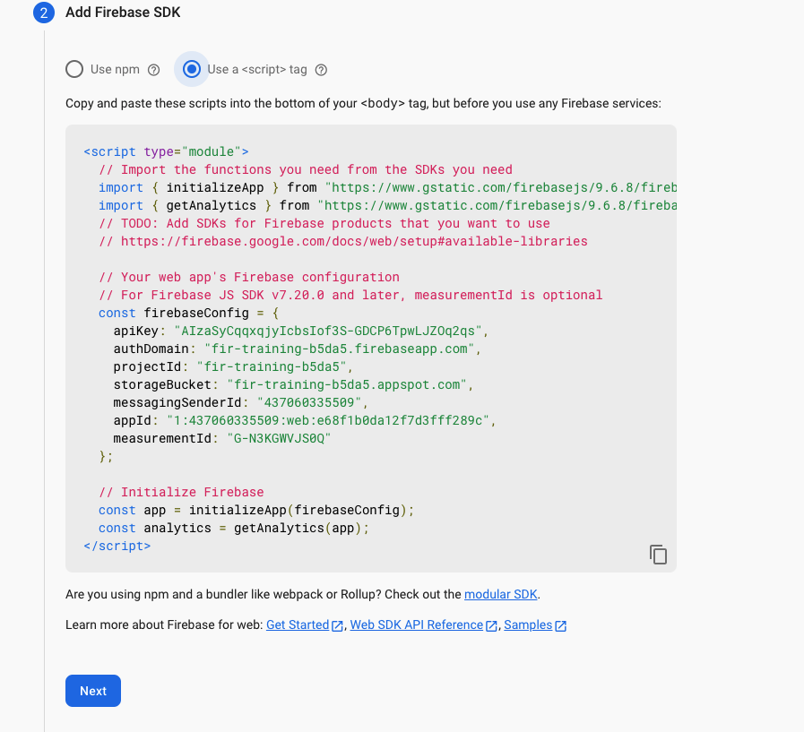

---
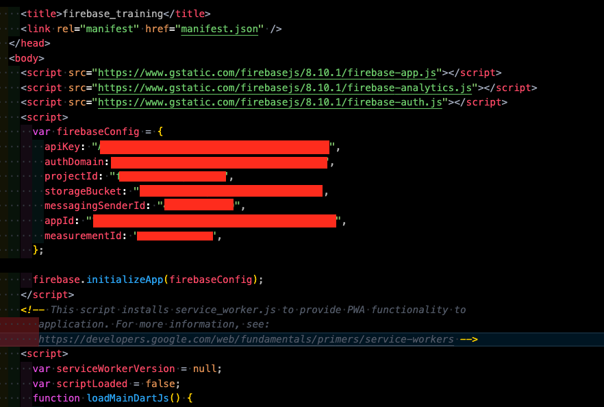

---
### Hosting steps...
Can be skipped for now, will be added and explained later

---
# All done
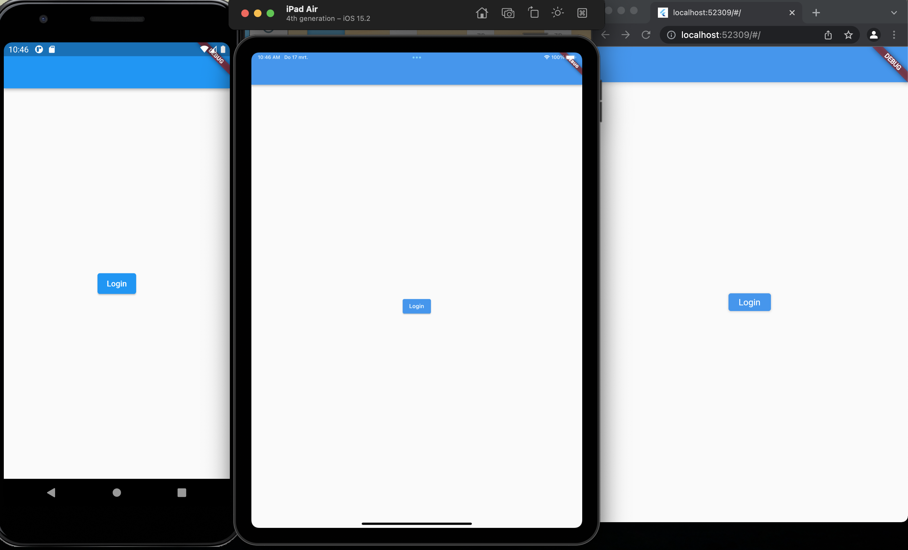
