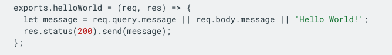
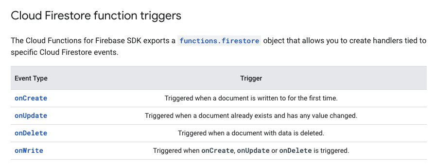
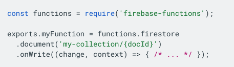
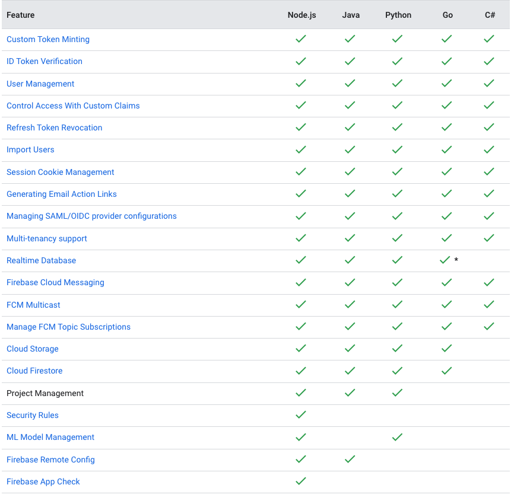
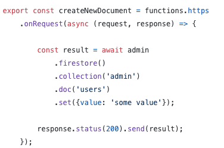

# Cloud Functions
---

### Features
- FaaS (Functions as a Service)
- No server management
- Scale based on load
- Monitoring, debugging and logging

---
### Setup
- Relies on some paid services
- Blaze tier is required for deployment

---
### Languages
- NodeJS (JavaScript)
- Python
- Go
- Java
- .NET (C#)
- Ruby
- PHP

---
### Possibilities
- Endless...
- Our main use case
    - Lightweight API

- Other interesting use cases
    - Data processing & ETL
    - Webhooks

---
### Examples

---
### Triggers

---
### Admin SDK

