# Security
---
## Realtime database
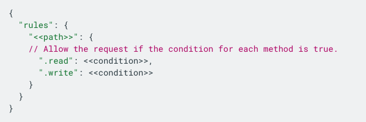

---
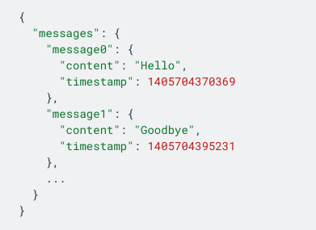
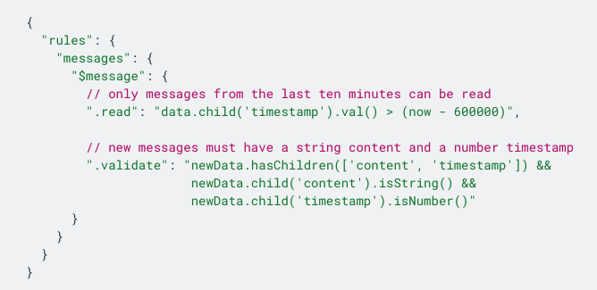

---
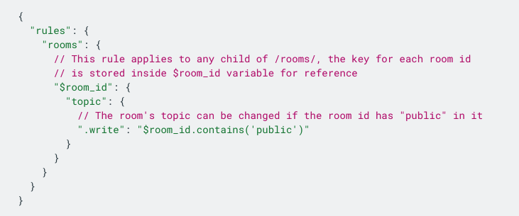
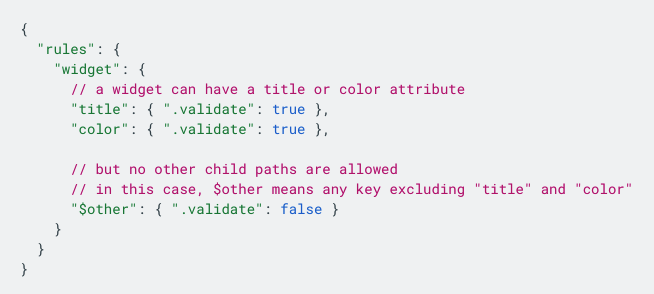

---
### Methods
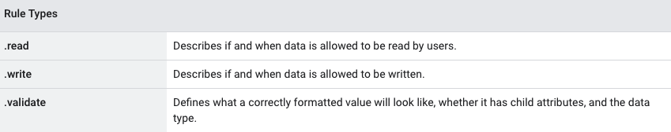

---
### Variables
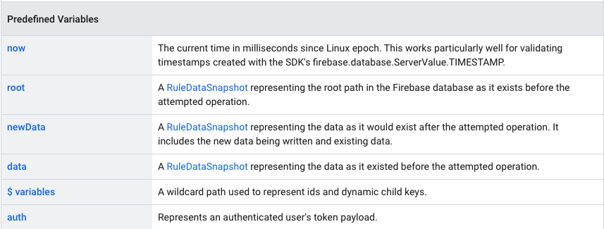

---
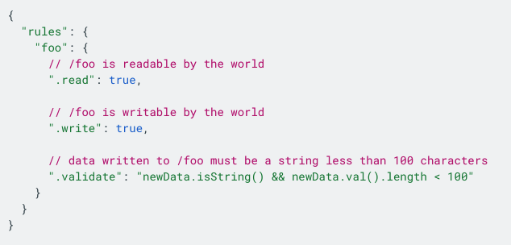

---
### Data-based
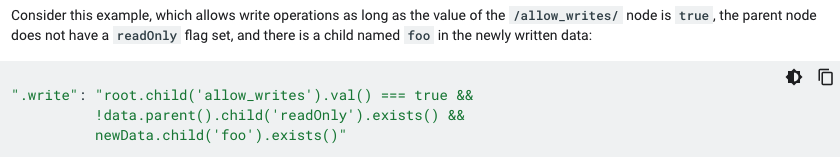

---
### Query-based
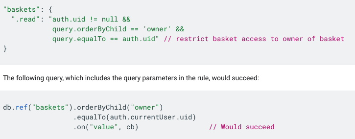

---
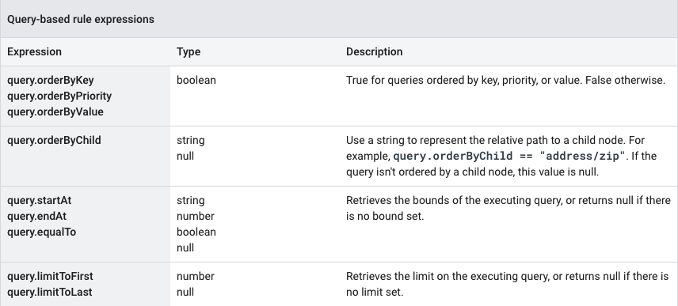

---
### Warning
- Rules are no filters!
    - Make the client’s query match the rules

- Rules are applied as OR statements, not AND statements.
- Missing rules will automatically resolve to false
- Shallow rules will overrule deeper rules

---
### Most used
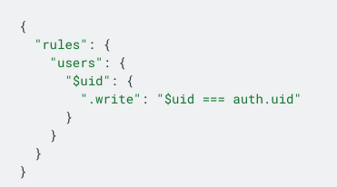

---
## Cloud Storage & Cloud Firestore
Like Realtime Database, but with a different syntax
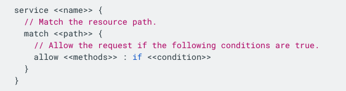

---
### Paths
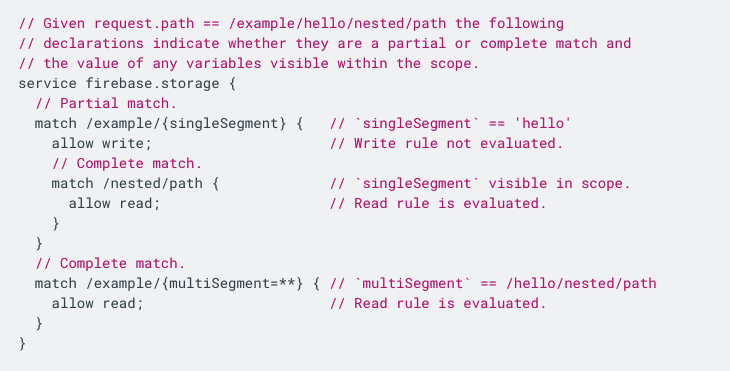

---
### Methods
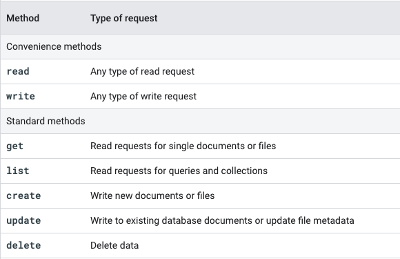

---
### Functions
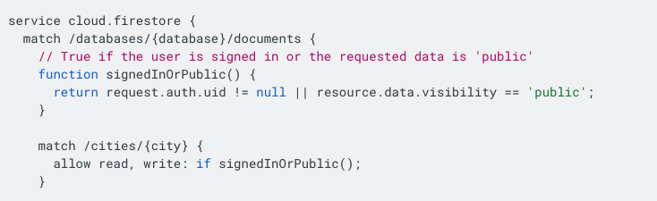

---
### "request"
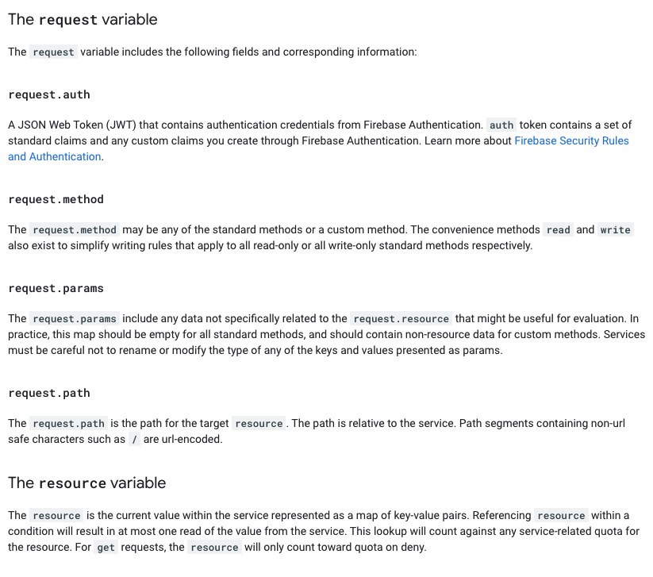

---
### Examples
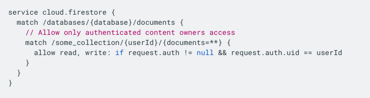
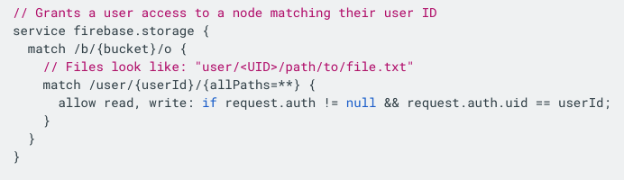

---
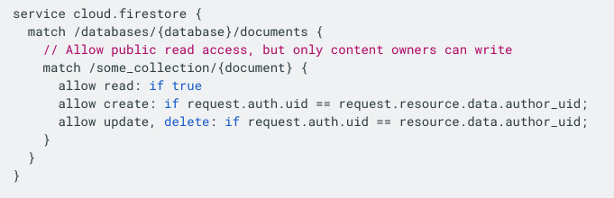
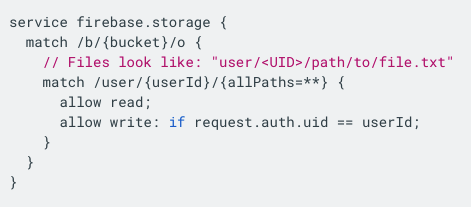

---
### DIY
- Write rules for your app
    - Realtime database
    - Cloud Storage
    - Cloud Firestore
