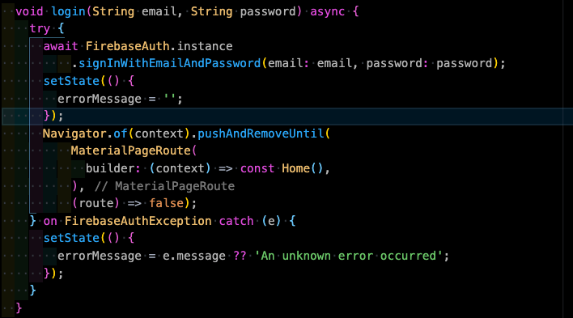

# Authentication
---

### Firebase preparation


---


---


---
### Pub.dev
- https://pub.dev/packages/firebase_auth/install

---
### Firebase Authentication for Flutter


---
### Code


---
### Sign up


---
### And now?
- Now we can sign in, so a user can authenticate itself.
- Authorization will be explained later.
- Doing something with an authenticated user...

---
### States - authStateChanges


---
### States - idTokenChanges


---
### States - userChanges


---
### Persistence
- IOS & Android out of the box, can be cleared by clearing app data in device settings.
- On web persistence is stored in local storage and can be configured

```await FirebaseAuth.instance.setPersistence(Persistence.NONE);```

---
### Other sign in providers
- Lots of sign in providers available
- Need extra configuration for each provider
- On pub.dev there are packages for some providers or an own implementation can be realized

- When social sign is used, Apple requires you to implement Apple's own sign in process

```FirebaseAuth.instance.signInWithCredential(credential)```

---
### Example of sign in with Facebook


---
### DIY
- Create a login screen
- Sign in with email and password
- Catch potential errors
- Optional: Sign up, password reset, stay signed in, styling, more sign-in providers etc.
