# Realtime Database
---

### Features
- NoSQL
- Cloud hosted
- Eventually consistent
- Schemaless
- JSON


---
### Setup
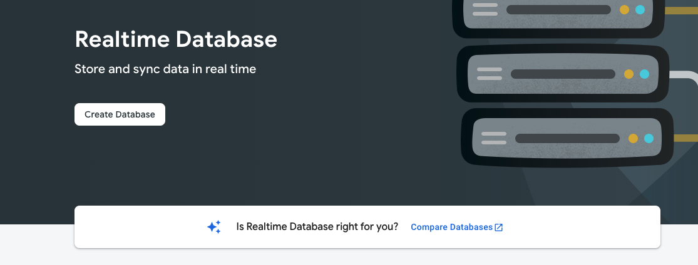

---
### Setup (2)
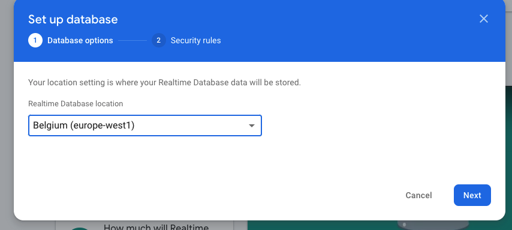

---
### Setup (3)
Rules will be covered later
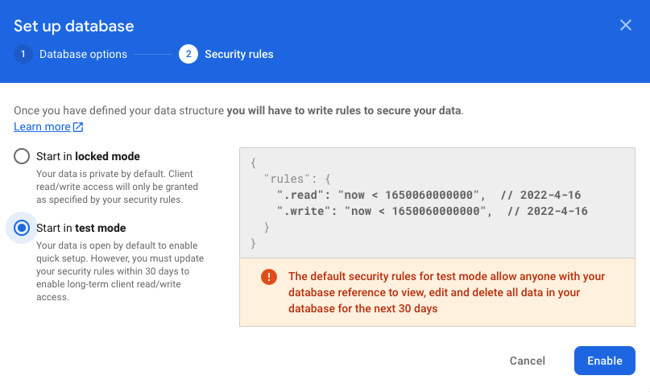

---
### Setup (4)
You might have to redownload and configure the configuration files for Android and IOS from the Firebase console, after that a Flutter clean should be enough

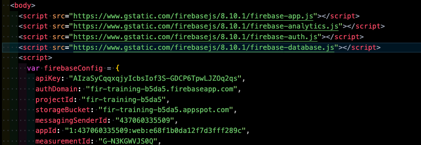

---
### Data types
- String
- boolean
- int
- double
- Map
- List

---
### Basic operations - Set
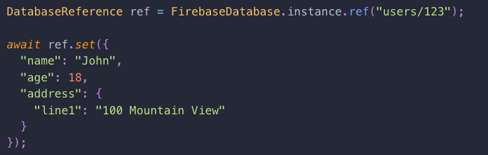

---
### Basic operations - Update
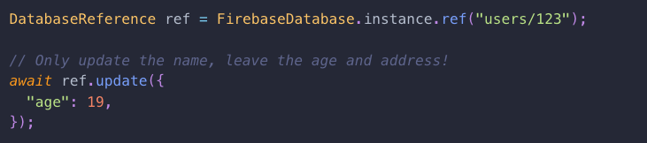

---
### Basic operations - Reading using get
When data is only needed one time
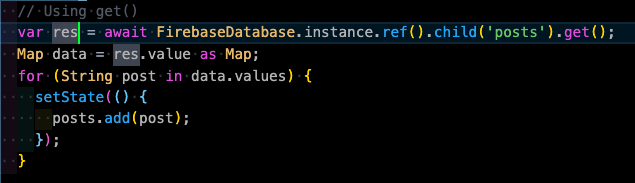

---
### Basic operations - Reading using once
When data is needed immediately without checking for changes on the server
once can be used to immediately get the data from local storage.
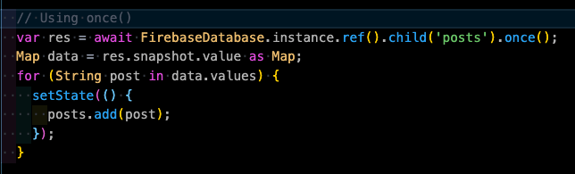

---
### Basic operations - Reading using onValue
Fires when changes to child nodes are detected
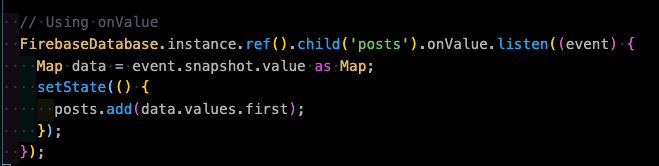

---
### Problem?
- We have posts in our app, when the app starts we want to get all posts from the server after retrieving we only want to get added or changed posts.
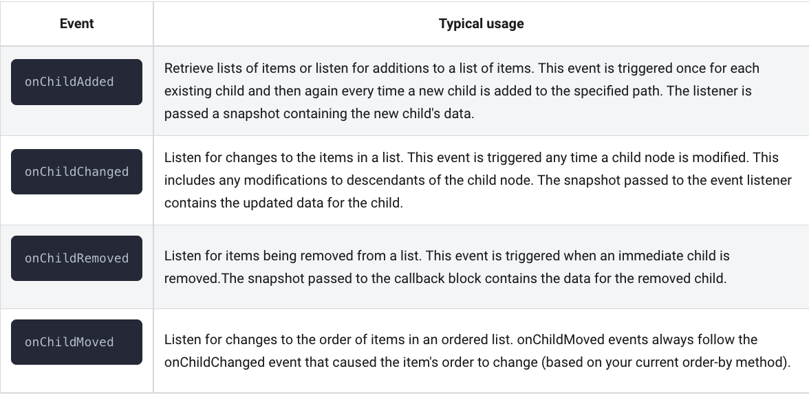

---
### Basic operations - Delete
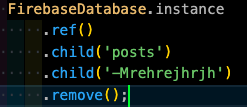

---
### Sorting
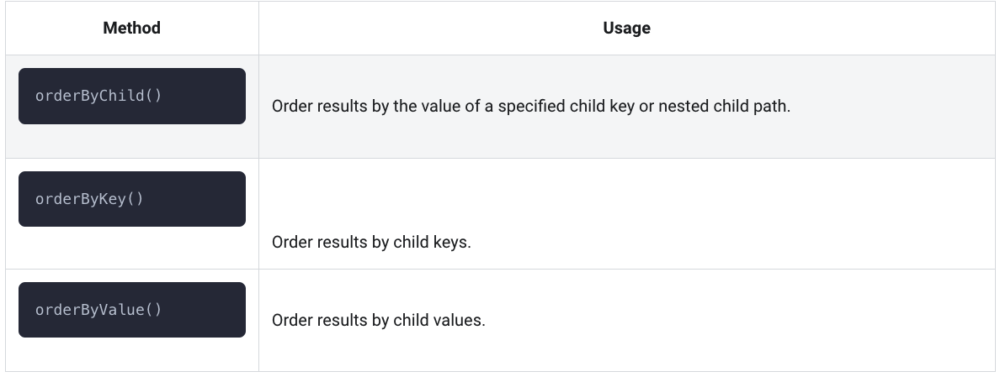

---
### Filtering
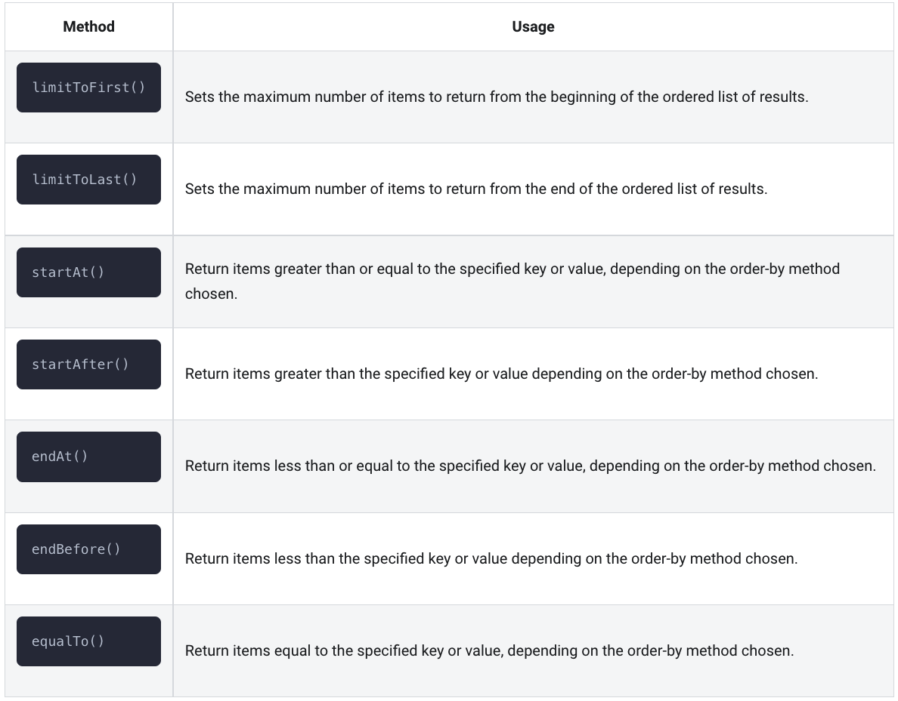

---
### Transactions
When working with data that COULD be changed by another client, you can use transactions to ensure that your changes are atomic. 
Transactions can be used for lots of different things.

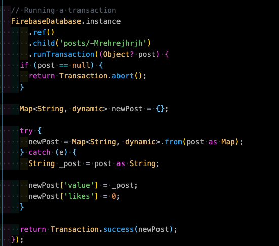


---
### Offline
The Firebase realtime database works offline and online.

Persistence can be enabled using ```FirebaseDatabase.instance.setPersistenceEnabled(true);```


This is done by having a local copy on your device, the SDK makes sure that data is eventually synchronized with the server.
Potential conflicts will be solved by the SDK.

---
### JSON Flattening
Firebase Realtime Database allows nesting up to 32 levels deep.

But...
Security is done at node level, when a user has access to a node. He also has access to all child nodes.
And when fetching data at a node, all child nodes will be included.

Therefore, an as flat as possible JSON structure is recommended!

---
### Example bad JSON
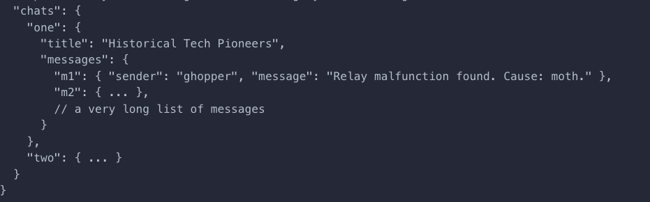

---
### Example Good JSON
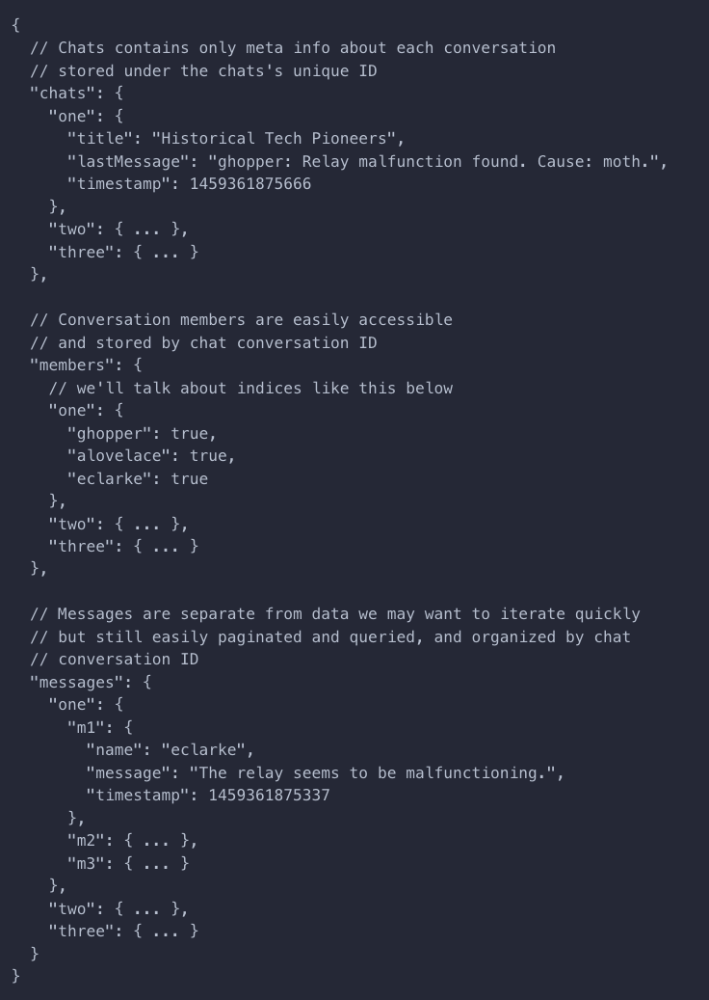

---
### Scaling
Sometimes two-way relationship between two nodes is needed, Especially when you have a lot of data.

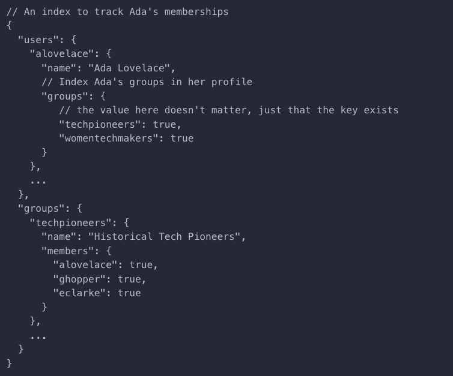

---
### DIY
- Create your own data structure for your app and implement it!
- Transactions and offline support are optional

