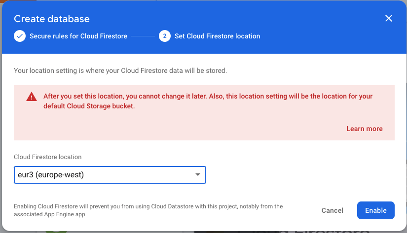
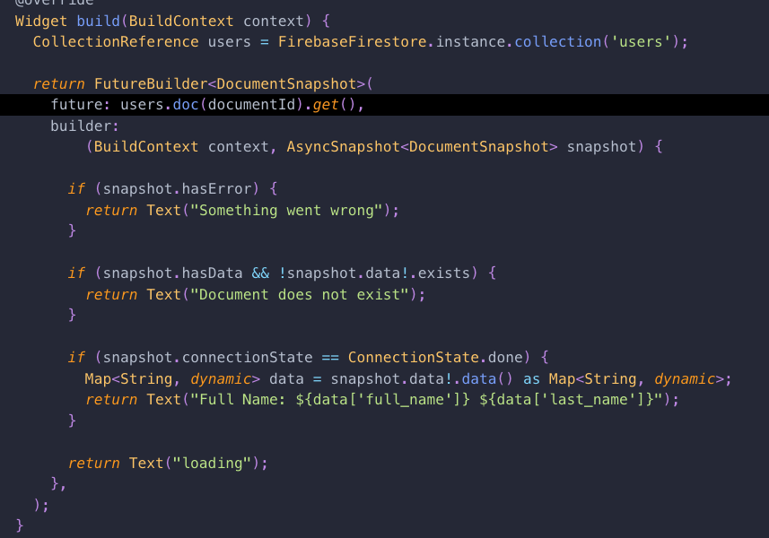
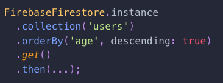

# Cloud Firestore
---

### Features
- NoSQL
- Cloud hosted
- Eventually consistent
- Schemaless
- Documents and collections

---
### Cloud Firestore vs Realtime Database
- Pro's
    - Security is made easier
    - The query language is more powerful
    - Multi-region support
    - Scaling is automatic (requires no sharding)

- Con's
    - Importing and exporting data is more difficult

---
### Setup


---
### Setup (2)


---
### Setup (3)


---
### Data types
- array
- boolean
- bytes
- date and time
- float
- geo point
- int
- map
- null
- string
- reference (document/collection)

---
### Basic operations - Add


---
### Basic operations - Update


---
### Basic operations - Get


---
### Basic operations - Delete


---
### Basic operations - Listen


---
### QuerySnapshot 
- Returned from a query on a Collection

### DocumentSnapshot 
- Return from a query on a Document

---
### Filtering


---
### Limiting


---
### Ordering


---
### Cursors


---
### Limitations
- Range filters on multiple fields
- Logical OR queries
- Not equal queries (can be achieved by using greater than and less than together)

---
### Converters
Firestore references manipulate a ```Map<String, dynamic>``` by default. For this reason we lose type safety
Using a converter we can convert the Map to a specific type and get type safety back


This manipulates the behavior of the query talked about.


---
### Transactions
- Read before write
- Won't work when client goes offline
- Can be used to ensure that your changes are atomic


---
### Batch
- Any combination of set, update and delete


---
### Offline
Firestore support offline support out-of-the-box

This is done by having a local database which is synced with the server.

When connectivity is lost, the local database is used to provide offline support.

Once connectivity is restored, the local database is synced with the server and migration is performed.

---
### DIY
- Rewrite the app to use Cloud Firestore instead of Realtime database


