# CLI
---

- Command Line Interface
- Managing
- Viewing
- Deploying

---
### Install
```npm install -g firebase-tools```

---
## Possibilities
### Configuration
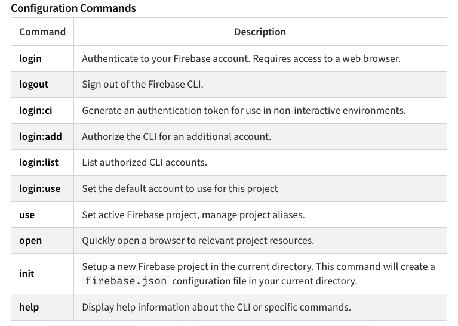

---
### Project management
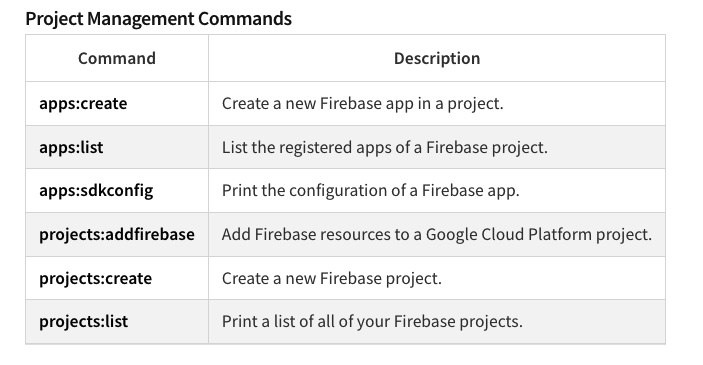

---
### Deployment and Emulation
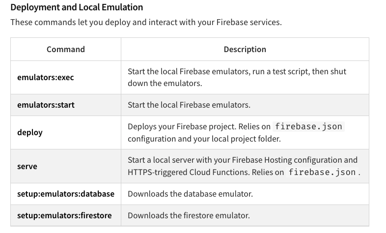

---
### App distribution
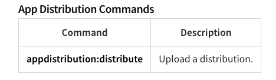

---
### Authentication
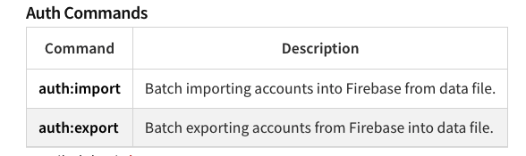

---
### Realtime Database
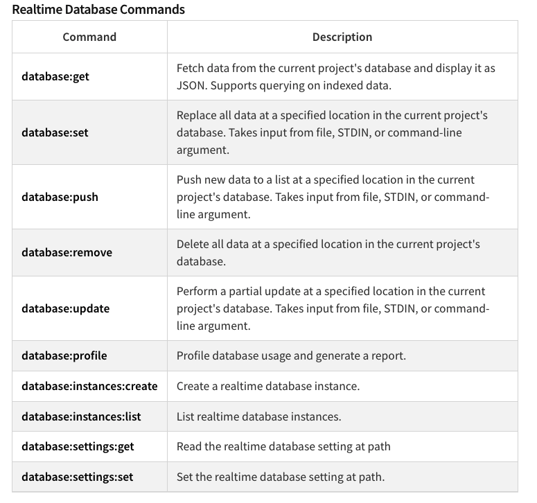

---
### Extensions
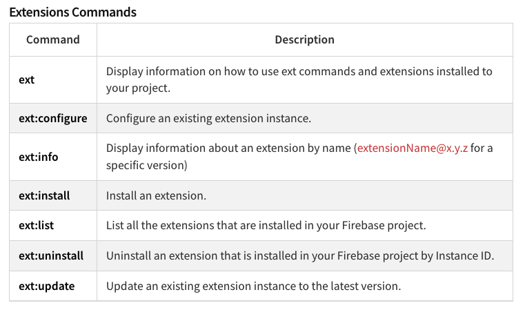

---
### Cloud Firestore
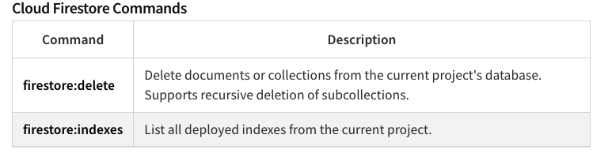

---
### Cloud Functions
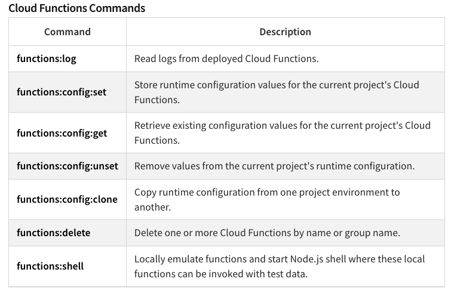

---
### Hosting
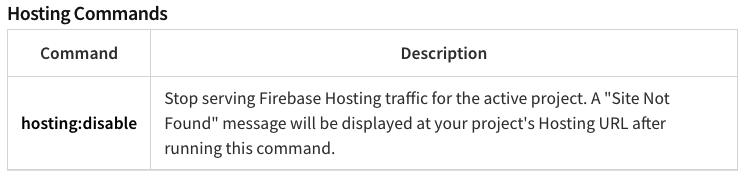

---
### Remote Config
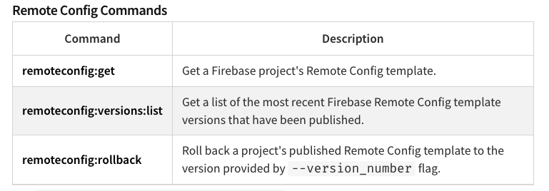
