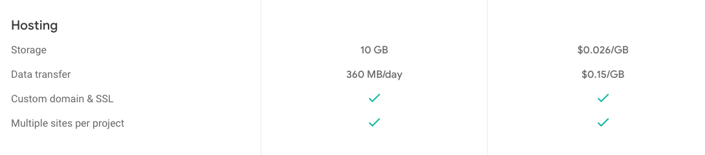
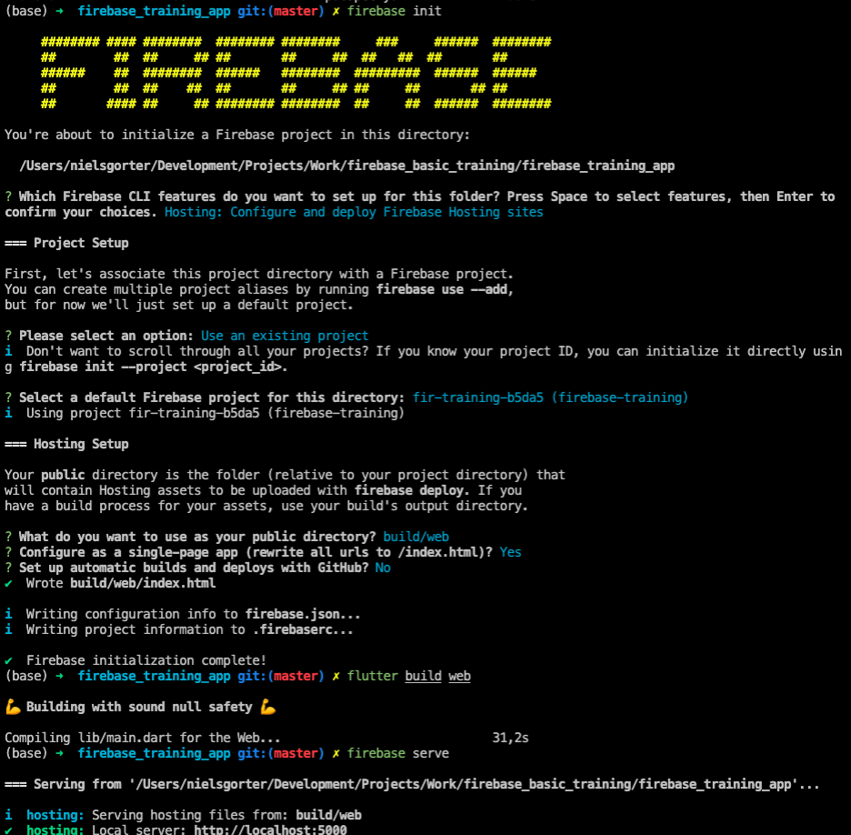

# Cloud Hosting
---

### Features
- Google's own hosting service
- SSL certificates are included
- Support custom domains



---
### Setup
- Make sure the Firebase CLI is installed
- ```firebase login```
- ```firebase init```
- ```flutter build web```
- ```firebase serve``` (for running)
- ```firebase deploy```



---
### DIY
- Deploy your app