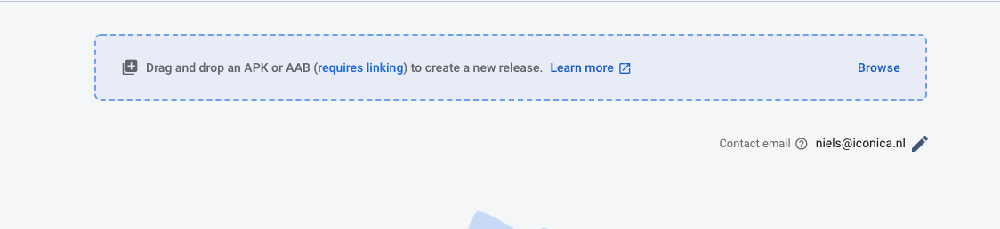
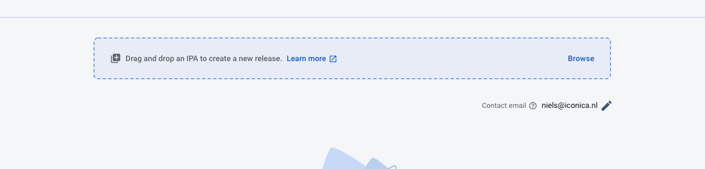

# App Distribution
---

### Introduction
An easy way to distribute your apps to testers.
- Works for IOS and Android

---
### Android
```flutter build apk --release```



---
### IOS
Open project in XCode, archive build and export



New testers first download a profile to deliver their device identifier. You (as developer) will get notified with a device UID. This needs to be added to the app's provisioning profile. After that you be required to resign and re-upload the app.

---
### Delivery
- Testers can get invited and notified by email
- Testers can join the test using a special link

---
### DIY
- Implement App Distribution in your own project
- Deliver the app for IOS and Android


