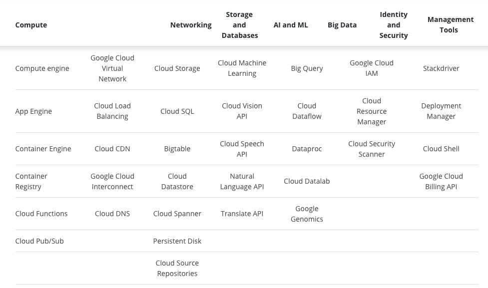

# Google Cloud
---

- Cloud vendor (like AWS & Azure)
- IaaS (Infrastructure as a Service) (VM etc.)
- PaaS (Platform as a Service) (OS's and other middleware)
- SaaS (Software as a Service) (Everything available via the web)

---
### Categories
- Compute
- Networking
- Storage and Databases
- Artificial Intelligence (AI) / Machine Learning (ML)
- Big Data
- Identity and Security
- Management Tools

---
### Services

---
### Why?
- Creation Firebase project
- Firebase adds 
    - SDK's
    - Tools
    - Configuration
- Mobile development